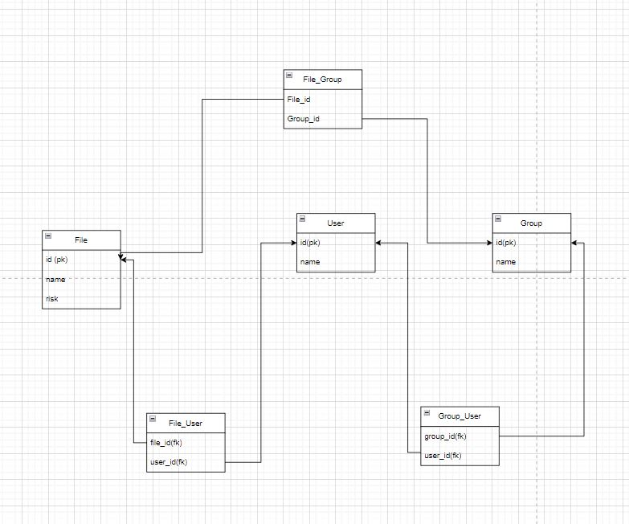

# FileManagementBackend

This is a FastAPI application designed to demonstrate CRUD operations for managing users, groups, and files. It utilizes PostgreSQL as the database and includes endpoints for creating, retrieving, and sharing users, groups, and files.


## DataBase Architecture



## Project Structure

This project has the following structure:

- **app/**: Main application directory.
- **config/**: Directory for configuration files.
  - **config.py**: Application configuration file.
- **database/**: Directory for database related files.
  - **database.py**: Database configuration and connection.
  - **operations/**: Directory for database operation files.
    - **files.py**: File-related database operations.
    - **groups.py**: Group-related database operations.
    - **users.py**: User-related database operations.
- **models/**: Directory for database model files.
  - **file.py**: File model definition.
  - **group.py**: Group model definition.
  - **user.py**: User model definition.
- **routes/**: Directory for API routes.
  - **files.py**: Routes related to files.
  - **groups.py**: Routes related to groups.
  - **users.py**: Routes related to users.
- **schemas/**: Directory for API request/response schemas.
  - **file.py**: File schema definition.
  - **file_user.py**: File-User relationship model definition.
  - **file_group.py**: File-Group relationship model definition.
  - **group.py**: Group schema definition.
  - **user.py**: User schema definition.
  - **user_group.py**: User-Group relationship model definition.
- **main.py**: Main application entry point.
- **utils/**: Directory for utility files.
  - **logger.py**: Logging utility.
  
- **.env**: Environment configuration file.

- **.gitignore**: Git ignore file specifying files and directories to be ignored by version control.

- **.dockerignore**: Docker ignore file specifying files and directories to be ignored by Docker when building images.

- **requirements.txt**: File containing project dependencies.

- **Dockerfile**: File for building Docker image for the application.

- **docker-compose.yml**: Docker Compose configuration file for defining services, networks, and volumes.


## Features

- **User Management**: Create users and retrieve user details by ID.
- **Group Management**: Create groups and retrieve group details by ID, and share groups with users.
- **File Management**: Create files, retrieve file details by ID, and share files with users or groups.
- **Logging**: Logs application events and errors to a file.

## Installation

1. **Clone the repository:**

   ```bash
   git clone https://github.com/Nivrin/FileManagementBackend.git
   ```

2. **Navigate to the project directory:**

   ```bash
    cd FileManagementBackend
   ```

3. **Run the docker compose**

   ```bash
    docker compose up --build
   ```

## Access the Application

application at [http://localhost:8000](http://localhost:8000)

swagger at [http://localhost:8000/docs](http://localhost:8000/docs)

logger at [http://localhost:8000/logs](http://localhost:8000/logs)

pgadmin at [http://localhost:9900](http://localhost:9900)

postgresql at [http://localhost:5432](http://localhost:5432)

# API Documentation

This document outlines the usage of the API endpoints provided by the application.

## Users

### Create User

- **Description:** Create a new user.
- **Endpoint:** POST /users/CreateUser/
- **Request Body:**
  - **user (UserCreate):** The details of the user to be created.
- **Response:**
  - **UserResponse:** The details of the created user.
- **Errors:**
  - 500 Internal Server Error: An error occurred during the creation process.

### Get All Users

- **Description:** Retrieve all users.
- **Endpoint:** GET /users/GetAllUsers/
- **Response:**
  - **List[UserResponse]:** A list of all users.
- **Errors:**
  - 500 Internal Server Error: An error occurred during the retrieval process.

### Get User By ID

- **Description:** Retrieve a user by its ID.
- **Endpoint:** GET /users/GetUserByID/
- **Query Parameters:**
  - **user_id (int):** The ID of the user to retrieve.
- **Response:**
  - **UserResponse:** The details of the requested user.
- **Errors:**
  - 404 Not Found: If the user with the specified ID is not found.
  - 500 Internal Server Error: An error occurred during the retrieval process.

## Groups

### Create Group

- **Description:** Create a new group.
- **Endpoint:** POST /groups/CreateGroup/
- **Request Body:**
  - **group (GroupCreate):** The details of the group to be created.
- **Response:**
  - **GroupResponse:** The details of the created group.
- **Errors:**
  - 500 Internal Server Error: An error occurred during the creation process.

### Get All Groups

- **Description:** Retrieve all user groups.
- **Endpoint:** GET /groups/GetAllGroups/
- **Response:**
  - **List[GroupResponse]:** A list of all user groups.
- **Errors:**
  - 500 Internal Server Error: An error occurred during the retrieval process.

### Get Group By ID

- **Description:** Retrieve a user group by its ID.
- **Endpoint:** GET /groups/GetGroupByID/
- **Query Parameters:**
  - **group_id (int):** The ID of the group to retrieve.
- **Response:**
  - **GroupResponse:** The details of the requested group.
- **Errors:**
  - 404 Not Found: If the group with the specified ID is not found.
  - 500 Internal Server Error: An error occurred during the retrieval process.

### Share Group With User

- **Description:** Share a user with a group.
- **Endpoint:** POST /groups/ShareGroupWithUser/
- **Query Parameters:**
  - **group_id (int):** The ID of the group to share with the user.
  - **user_id (int):** The ID of the user to share with the group.
- **Response:**
  - **GroupResponse:** The details of the group after sharing.
- **Errors:**
  - 404 Not Found: If the user or group with the specified IDs are not found.
  - 500 Internal Server Error: An error occurred during the sharing process.

## Files

### Create File

- **Description:** Create a new file.
- **Endpoint:** POST /files/CreateFile/
- **Request Body:**
  - **file (FileCreate):** The details of the file to be created.
- **Response:**
  - **FileResponse:** The details of the created file.
- **Errors:**
  - 500 Internal Server Error: An error occurred during the creation process.

### Get All Files

- **Description:** Retrieve all files.
- **Endpoint:** GET /files/GetAllFiles/
- **Response:**
  - **List[FileResponse]:** A list of all files.
- **Errors:**
  - 500 Internal Server Error: An error occurred during the retrieval process.

### Get File By ID

- **Description:** Retrieve a file by its ID.
- **Endpoint:** GET /files/GetFileByID/
- **Query Parameters:**
  - **file_id (int):** The ID of the file to retrieve.
- **Response:**
  - **FileResponse:** The details of the requested file.
- **Errors:**
  - 404 Not Found: If the file with the specified ID is not found.
  - 500 Internal Server Error: An error occurred during the retrieval process.

## Share File With User

- **Description:** Share a file with a user.
- **Endpoint:** POST /files/ShareFileWithUser/
- **Query Parameters:**
  - **user_id (int):** The ID of the user to share the file with.
- **Response:**
  - **FileResponse:** The details of the file after sharing.
- **Errors:**
  - 404 Not Found: If the file or user with the specified IDs are not found.
  - 500 Internal Server Error: An error occurred during the sharing process.


## Share File With Group

- **Description:** Share a file with a group.
- **Endpoint:** POST /files/ShareFileWithGroup/
- **Query Parameters:**
  - **group_id (int):** The ID of the group to share the file with.
- **Response:**
  - **FileResponse:** The details of the file after sharing.
- **Errors:**
  - 404 Not Found: If the file or group with the specified IDs are not found.
  - 500 Internal Server Error: An error occurred during the sharing process.

### Get Top Shared Files

- **Description:** Retrieve the top shared files.
- **Endpoint:** GET /files/TopSharedFiles/
- **Query Parameters:**
  - **k (int):** The number of top shared files to retrieve. Default is 5.
- **Response:**
  - **List[FileTopSharedResponse]:** A list of FileTopSharedResponse objects representing the top shared files.
- **Errors:**
  - 500 Internal Server Error: An error occurred during the retrieval process.

## Additional Endpoints

### Health Check

- **Description:** Check the health of the application.
- **Endpoint:** GET /
- **Response:**
  - {"status": "UP"}

### Get Logs

- **Description:** Retrieve application logs - internal use for debugging
- **Endpoint:** GET /logs
- **Response:**
  - Log file content if available, otherwise 404 Not Found.
